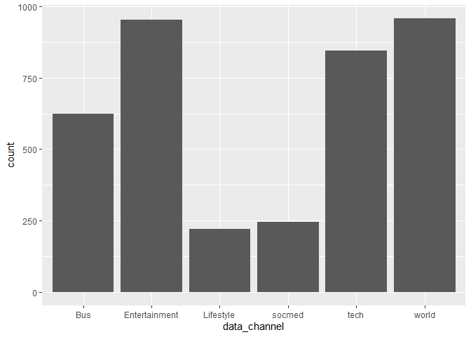
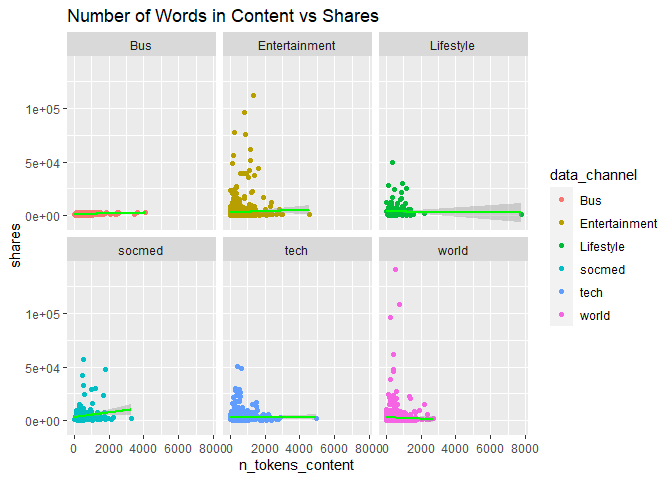
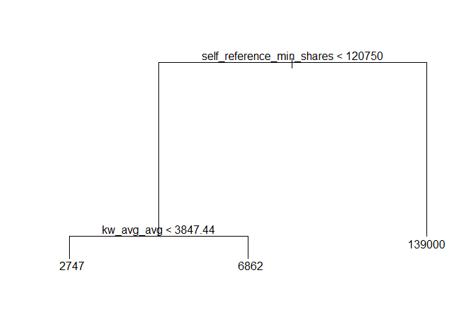
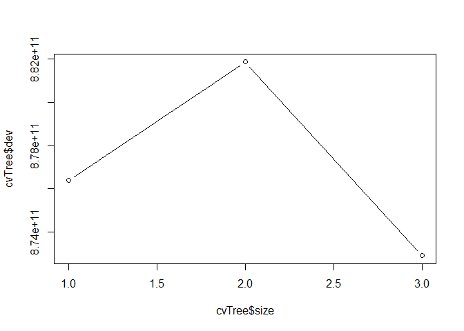

Project 2
================
Shelnes Elie
10/13/2020

*Introduction*
==============

The data in this project represents the online news popularity. This
dataset summarizes a heterogeneous set of features about articles
published by Mashable in a period of two years. The goal is to predict
the number of shares in social networks (popularity).Some of the
variables used are:

-   weekday\_is/is\_weekend = represents what day of the week or is it
    the weekend.  
-   shares = \# of shares/target  
-   LDA = Close to LDA topic  
-   n\_tokens\_content = Number of words in the content  
-   data\_channel\_is\_lifestyle = Is data channel ‘Lifestyle’?  
-   data\_channel\_is\_entertainment = Is data channel
    ‘Entertainment’?  
-   data\_channel\_is\_bus = Is data channel ‘Business’?  
-   data\_channel\_is\_socmed = Is data channel ‘Social Media’?  
-   data\_channel\_is\_tech = Is data channel ‘Tech’?  
-   data\_channel\_is\_world = Is data channel ‘World’?

*Summarization*
===============

The below summary describes the measure of center for shares.

    ## [1] "weekday_is_sunday"

    ##    Min. 1st Qu.  Median    Mean 3rd Qu.    Max. 
    ##      89    1200    1900    3747    3700   83300

*Graphs*
========

Barchart
--------

The below barchart shows the count for each data channel when it equals
1 or is active. As you can see, world, tech, and entertainment’s
frequency are very high while lifestyle and socmed are very low.

    # Plots

    ggplot(channels, aes(data_channel)) +
      geom_bar()

<!-- -->

Boxplot
-------

Below displays boxplots for shares broken by data channel.We can see
that there’s outliers for the shares. All the data channels seem to have
condensed measure of center, especially bus.This should make predicting
shares easier for some data\_channels.

    ggplot(channels, aes(x = data_channel, y = shares))+ 
      geom_jitter(aes(color = data_channel)) + ggtitle("Boxplot for Shares") + 
      geom_boxplot() 

<!-- -->

Scatterplot
-----------

The scatterplots below represent the total words in the content vs
shares broken down by each data\_channel. We can see that all the
data\_channels try to the words below 2000 except for some outliers.
This must be to maintain the attention of the readers as the shares are
the highest in this area.

    ggplot(channels, aes(x = n_tokens_content, y = shares, group = data_channel)) + geom_point(aes(color = data_channel)) + geom_smooth(method = 'lm', color = 'green') +
      ggtitle("Number of Words in Content vs Shares") + facet_wrap(~data_channel)

    ## `geom_smooth()` using formula 'y ~ x'

<!-- -->

*Modeling*
==========

Goal: Create models for predicting the shares variable.

Regression Tree
---------------

A (not ensemble) tree-based model chosen using leave one out cross
validation  
Root MSE is used on the test data set to see how well the model is.

    # a (not ensemble) tree-based model chosen using leave one out cross validation
    # Regression Tree
    treeFit <- tree(shares ~ . ,data = newsDataTrain)
    plot(treeFit); text(treeFit)

<!-- -->

    cvTree <- cv.tree(treeFit); cvTree

    ## $size
    ## [1] 5 3 2 1
    ## 
    ## $dev
    ## [1] 91195677029 89772763107 86026168504 86026168504
    ## 
    ## $k
    ## [1]       -Inf 1130178522 1808380094 1885750204
    ## 
    ## $method
    ## [1] "deviance"
    ## 
    ## attr(,"class")
    ## [1] "prune"         "tree.sequence"

    # Visual of How CV Error Changes w/# of Nodes
    plot(cvTree$size, cvTree$dev, type="b")

<!-- -->

    # Predictions usingpredict
    pred <- predict(treeFit, newdata=dplyr::select(newsDataTest,-shares))

    # Root MSE
    sqrt(mean((pred-newsDataTest$shares)^2))

    ## [1] 5400.919

Boosted Tree
------------

Model chosen using cross-validation  
Utilizing misclassification rate to evaluate the model.

    boostTree <- train(shares ~ ., data = newsDataTrain, method = "gbm",
    trControl = trainControl(method = "repeatedcv", number = 4, repeats = 2),
    preProcess = c("center", "scale"), verbose = FALSE)
    boostTree

    ## Stochastic Gradient Boosting 
    ## 
    ## 1915 samples
    ##   59 predictor
    ## 
    ## Pre-processing: centered (59), scaled (59) 
    ## Resampling: Cross-Validated (4 fold, repeated 2 times) 
    ## Summary of sample sizes: 1437, 1436, 1436, 1436, 1436, 1436, ... 
    ## Resampling results across tuning parameters:
    ## 
    ##   interaction.depth  n.trees  RMSE      Rsquared    MAE     
    ##   1                   50      6541.764  0.01659501  3191.720
    ##   1                  100      6575.008  0.01742368  3218.331
    ##   1                  150      6581.683  0.01842560  3219.485
    ##   2                   50      6563.612  0.01815619  3195.893
    ##   2                  100      6646.562  0.01784623  3289.739
    ##   2                  150      6687.913  0.01868482  3321.482
    ##   3                   50      6611.347  0.01725423  3271.108
    ##   3                  100      6671.130  0.01950540  3331.767
    ##   3                  150      6730.086  0.01816474  3412.123
    ## 
    ## Tuning parameter 'shrinkage' was held constant at a value of 0.1
    ## 
    ## Tuning parameter 'n.minobsinnode' was held constant at a value of 10
    ## RMSE was used to select the optimal model using the smallest value.
    ## The final values used for the model were n.trees = 50, interaction.depth =
    ##  1, shrinkage = 0.1 and n.minobsinnode = 10.

    boostTbl <- table(data.frame(pred = predict(boostTree, newsDataTest), true = newsDataTest$shares))

    #misclassificatoon rate to evaluate model
    1-c(boost = sum(diag(boostTbl)/sum(boostTbl)))

    ##     boost 
    ## 0.9963504

Linear Regression Model
-----------------------

The final model we will examine is a linear regression model. The model
will be fit with all possible predictors using the `lm` function. Also,
predictions utilizing this model will be made on the test set using
`predict`.

    lmfit <- lm(shares ~ ., data = newsDataTrain)
    lmpred <- predict(lmfit, newdata = newsDataTest)
    head(lmpred)        

    ##        1        2        3        4        5        6 
    ## 4639.902 1644.872 1340.974 3911.860 3229.171 4159.267

    render_html_fun <- function(hub_in){
      rmarkdown::render('Project-02.Rproj',
                        output_file = paste0('Project2', hub_in, "_", '.html'),
                        params = list(hub = hub_in, set_title = hub))}

    hubs_input <- c("weekday_is_monday", "weekday_is_tuesday", "weekday_is_wednesday", 
                    "weekday_is_thursday", "weekday_is_friday", "weekday_is_saturday", 
                    "weekday_is_sunday")

    walk(hubs_input, render_html_fun)
