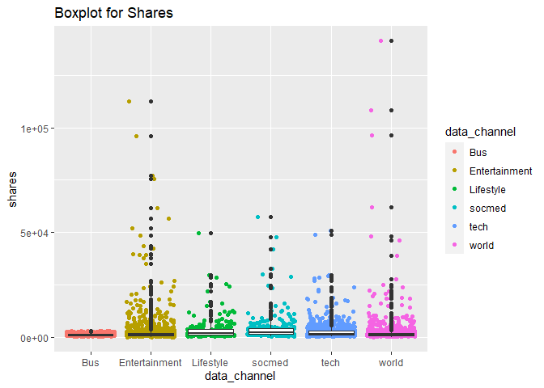

Project 2
================
Shelnes Elie
10/13/2020

# *Introduction*

The data in this project represents the online news popularity. This
dataset summarizes a heterogeneous set of features about articles
published by Mashable in a period of two years. The goal is to predict
the number of shares in social networks (popularity).Some of the
variables used are:

  - weekday\_is/is\_weekend = represents what day of the week or is it
    the weekend.  
  - shares = \# of shares/target  
  - LDA = Close to LDA topic  
  - n\_tokens\_content = Number of words in the content  
  - data\_channel\_is\_lifestyle = Is data channel ‘Lifestyle’?  
  - data\_channel\_is\_entertainment = Is data channel
    ‘Entertainment’?  
  - data\_channel\_is\_bus = Is data channel ‘Business’?  
  - data\_channel\_is\_socmed = Is data channel ‘Social Media’?  
  - data\_channel\_is\_tech = Is data channel ‘Tech’?  
  - data\_channel\_is\_world = Is data channel ‘World’?

# *Summarization*

The below summary describes the measure of center for shares.

    ## [1] "weekday_is_monday"

    ##    Min. 1st Qu.  Median    Mean 3rd Qu.    Max. 
    ##       1     919    1400    3647    2700  690400

# *Graphs*

## Barchart

The below barchart shows the count for each data channel when it equals
1 or is active. As you can see, world, tech, and entertainment’s
frequency are very high while lifestyle and socmed are very low.

``` r
# Plots

ggplot(channels, aes(data_channel)) +
  geom_bar()
```

<!-- -->

## Boxplot

Below displays boxplots for shares broken by data channel.We can see
that there’s outliers for the shares. All the data channels seem to have
condensed measure of center, especially bus.This should make predicting
shares easier for some data\_channels.

``` r
ggplot(channels, aes(x = data_channel, y = shares))+ 
  geom_jitter(aes(color = data_channel)) + ggtitle("Boxplot for Shares") + 
  geom_boxplot() 
```

<!-- -->

## Scatterplot

The scatterplots below represent the total words in the content vs
shares broken down by each data\_channel. We can see that all the
data\_channels try to the words below 2000 except for some outliers.
This must be to maintain the attention of the readers as the shares are
the highest in this area.

``` r
ggplot(channels, aes(x = n_tokens_content, y = shares, group = data_channel)) + geom_point(aes(color = data_channel)) + geom_smooth(method = 'lm', color = 'green') +
  ggtitle("Number of Words in Content vs Shares") + facet_wrap(~data_channel)
```

    ## `geom_smooth()` using formula 'y ~ x'

<!-- -->

# *Modeling*

Goal: Create models for predicting the shares variable.

## Regression Tree

A (not ensemble) tree-based model chosen using leave one out cross
validation  
Root MSE is used on the test data set to see how well the model is.

``` r
# a (not ensemble) tree-based model chosen using leave one out cross validation
# Regression Tree
treeFit <- tree(shares ~ . ,data = newsDataTrain)
plot(treeFit); text(treeFit)
```

<!-- -->

``` r
cvTree <- cv.tree(treeFit); cvTree
```

    ## $size
    ## [1] 3 2 1
    ## 
    ## $dev
    ## [1] 872908710392 881873024193 876391576936
    ## 
    ## $k
    ## [1]        -Inf 11745665602 91735314491
    ## 
    ## $method
    ## [1] "deviance"
    ## 
    ## attr(,"class")
    ## [1] "prune"         "tree.sequence"

``` r
# Visual of How CV Error Changes w/# of Nodes
plot(cvTree$size, cvTree$dev, type="b")
```

<!-- -->

``` r
# Predictions usingpredict
pred <- predict(treeFit, newdata=dplyr::select(newsDataTest,-shares))

# Root MSE
sqrt(mean((pred-newsDataTest$shares)^2))
```

    ## [1] 18251.86

## Boosted Tree

Model chosen using cross-validation  
Utilizing misclassification rate to evaluate the model.

``` r
boostTree <- train(shares ~ ., data = newsDataTrain, method = "gbm",
trControl = trainControl(method = "repeatedcv", number = 4, repeats = 2),
preProcess = c("center", "scale"), verbose = FALSE)
boostTree
```

    ## Stochastic Gradient Boosting 
    ## 
    ## 4662 samples
    ##   59 predictor
    ## 
    ## Pre-processing: centered (59), scaled (59) 
    ## Resampling: Cross-Validated (4 fold, repeated 2 times) 
    ## Summary of sample sizes: 3498, 3495, 3497, 3496, 3495, 3496, ... 
    ## Resampling results across tuning parameters:
    ## 
    ##   interaction.depth  n.trees  RMSE      Rsquared     MAE     
    ##   1                   50      12613.42  0.008803732  3719.534
    ##   1                  100      12740.91  0.007071247  3756.895
    ##   1                  150      12810.78  0.007225911  3807.365
    ##   2                   50      12314.28  0.022417965  3648.679
    ##   2                  100      12443.18  0.021406636  3686.139
    ##   2                  150      12543.78  0.019391978  3701.252
    ##   3                   50      12445.04  0.014508240  3700.085
    ##   3                  100      12540.10  0.013951534  3770.684
    ##   3                  150      12650.68  0.010157017  3814.283
    ## 
    ## Tuning parameter 'shrinkage' was held constant at a value of 0.1
    ## 
    ## Tuning parameter 'n.minobsinnode' was held constant at a value of 10
    ## RMSE was used to select the optimal model using the smallest value.
    ## The final values used for the model were n.trees = 50, interaction.depth =
    ##  2, shrinkage = 0.1 and n.minobsinnode = 10.

``` r
boostTbl <- table(data.frame(pred = predict(boostTree, newsDataTest), true = newsDataTest$shares))


#misclassificatoon rate to evaluate model
1-c(boost = sum(diag(boostTbl)/sum(boostTbl)))
```

    ##     boost 
    ## 0.9994997

``` r
render_html_fun <- function(hub_in){
  rmarkdown::render('Project-02.Rproj',
                    output_file = paste0('Project2', hub_in, "_", '.md'),
                    params = list(hub = hub_in))}


hubs_input <- c("weekday_is_monday", "weekday_is_tuesday", "weekday_is_wednesday", 
                "weekday_is_thursday", "weekday_is_friday", "weekday_is_saturday", 
                "weekday_is_sunday")

walk(hubs_input, render_html_fun)
```

    ## "C:/Program Files/RStudio/bin/pandoc/pandoc" +RTS -K512m -RTS Project-02.utf8.md --to html4 --from markdown+autolink_bare_uris+tex_math_single_backslash --output Project2weekday_is_monday_.md --email-obfuscation none --self-contained --standalone --section-divs --template "C:\Users\6025\Documents\R\win-library\4.0\rmarkdown\rmd\h\default.html" --no-highlight --variable highlightjs=1 --variable "theme:bootstrap" --include-in-header "C:\Users\6025\AppData\Local\Temp\RtmpeOlzRK\rmarkdown-str38c8686a7528.html" --mathjax --variable "mathjax-url:https://mathjax.rstudio.com/latest/MathJax.js?config=TeX-AMS-MML_HTMLorMML" --lua-filter "C:/Users/6025/Documents/R/win-library/4.0/rmarkdown/rmd/lua/pagebreak.lua" --lua-filter "C:/Users/6025/Documents/R/win-library/4.0/rmarkdown/rmd/lua/latex-div.lua" 
    ## "C:/Program Files/RStudio/bin/pandoc/pandoc" +RTS -K512m -RTS Project-02.utf8.md --to html4 --from markdown+autolink_bare_uris+tex_math_single_backslash --output Project2weekday_is_tuesday_.md --email-obfuscation none --self-contained --standalone --section-divs --template "C:\Users\6025\Documents\R\win-library\4.0\rmarkdown\rmd\h\default.html" --no-highlight --variable highlightjs=1 --variable "theme:bootstrap" --include-in-header "C:\Users\6025\AppData\Local\Temp\RtmpeOlzRK\rmarkdown-str38c8726c5ed5.html" --mathjax --variable "mathjax-url:https://mathjax.rstudio.com/latest/MathJax.js?config=TeX-AMS-MML_HTMLorMML" --lua-filter "C:/Users/6025/Documents/R/win-library/4.0/rmarkdown/rmd/lua/pagebreak.lua" --lua-filter "C:/Users/6025/Documents/R/win-library/4.0/rmarkdown/rmd/lua/latex-div.lua" 
    ## "C:/Program Files/RStudio/bin/pandoc/pandoc" +RTS -K512m -RTS Project-02.utf8.md --to html4 --from markdown+autolink_bare_uris+tex_math_single_backslash --output Project2weekday_is_wednesday_.md --email-obfuscation none --self-contained --standalone --section-divs --template "C:\Users\6025\Documents\R\win-library\4.0\rmarkdown\rmd\h\default.html" --no-highlight --variable highlightjs=1 --variable "theme:bootstrap" --include-in-header "C:\Users\6025\AppData\Local\Temp\RtmpeOlzRK\rmarkdown-str38c8510a5cd3.html" --mathjax --variable "mathjax-url:https://mathjax.rstudio.com/latest/MathJax.js?config=TeX-AMS-MML_HTMLorMML" --lua-filter "C:/Users/6025/Documents/R/win-library/4.0/rmarkdown/rmd/lua/pagebreak.lua" --lua-filter "C:/Users/6025/Documents/R/win-library/4.0/rmarkdown/rmd/lua/latex-div.lua" 
    ## "C:/Program Files/RStudio/bin/pandoc/pandoc" +RTS -K512m -RTS Project-02.utf8.md --to html4 --from markdown+autolink_bare_uris+tex_math_single_backslash --output Project2weekday_is_thursday_.md --email-obfuscation none --self-contained --standalone --section-divs --template "C:\Users\6025\Documents\R\win-library\4.0\rmarkdown\rmd\h\default.html" --no-highlight --variable highlightjs=1 --variable "theme:bootstrap" --include-in-header "C:\Users\6025\AppData\Local\Temp\RtmpeOlzRK\rmarkdown-str38c8142a3150.html" --mathjax --variable "mathjax-url:https://mathjax.rstudio.com/latest/MathJax.js?config=TeX-AMS-MML_HTMLorMML" --lua-filter "C:/Users/6025/Documents/R/win-library/4.0/rmarkdown/rmd/lua/pagebreak.lua" --lua-filter "C:/Users/6025/Documents/R/win-library/4.0/rmarkdown/rmd/lua/latex-div.lua" 
    ## "C:/Program Files/RStudio/bin/pandoc/pandoc" +RTS -K512m -RTS Project-02.utf8.md --to html4 --from markdown+autolink_bare_uris+tex_math_single_backslash --output Project2weekday_is_friday_.md --email-obfuscation none --self-contained --standalone --section-divs --template "C:\Users\6025\Documents\R\win-library\4.0\rmarkdown\rmd\h\default.html" --no-highlight --variable highlightjs=1 --variable "theme:bootstrap" --include-in-header "C:\Users\6025\AppData\Local\Temp\RtmpeOlzRK\rmarkdown-str38c856de7148.html" --mathjax --variable "mathjax-url:https://mathjax.rstudio.com/latest/MathJax.js?config=TeX-AMS-MML_HTMLorMML" --lua-filter "C:/Users/6025/Documents/R/win-library/4.0/rmarkdown/rmd/lua/pagebreak.lua" --lua-filter "C:/Users/6025/Documents/R/win-library/4.0/rmarkdown/rmd/lua/latex-div.lua" 
    ## "C:/Program Files/RStudio/bin/pandoc/pandoc" +RTS -K512m -RTS Project-02.utf8.md --to html4 --from markdown+autolink_bare_uris+tex_math_single_backslash --output Project2weekday_is_saturday_.md --email-obfuscation none --self-contained --standalone --section-divs --template "C:\Users\6025\Documents\R\win-library\4.0\rmarkdown\rmd\h\default.html" --no-highlight --variable highlightjs=1 --variable "theme:bootstrap" --include-in-header "C:\Users\6025\AppData\Local\Temp\RtmpeOlzRK\rmarkdown-str38c818ed457d.html" --mathjax --variable "mathjax-url:https://mathjax.rstudio.com/latest/MathJax.js?config=TeX-AMS-MML_HTMLorMML" --lua-filter "C:/Users/6025/Documents/R/win-library/4.0/rmarkdown/rmd/lua/pagebreak.lua" --lua-filter "C:/Users/6025/Documents/R/win-library/4.0/rmarkdown/rmd/lua/latex-div.lua" 
    ## "C:/Program Files/RStudio/bin/pandoc/pandoc" +RTS -K512m -RTS Project-02.utf8.md --to html4 --from markdown+autolink_bare_uris+tex_math_single_backslash --output Project2weekday_is_sunday_.md --email-obfuscation none --self-contained --standalone --section-divs --template "C:\Users\6025\Documents\R\win-library\4.0\rmarkdown\rmd\h\default.html" --no-highlight --variable highlightjs=1 --variable "theme:bootstrap" --include-in-header "C:\Users\6025\AppData\Local\Temp\RtmpeOlzRK\rmarkdown-str38c865a4862.html" --mathjax --variable "mathjax-url:https://mathjax.rstudio.com/latest/MathJax.js?config=TeX-AMS-MML_HTMLorMML" --lua-filter "C:/Users/6025/Documents/R/win-library/4.0/rmarkdown/rmd/lua/pagebreak.lua" --lua-filter "C:/Users/6025/Documents/R/win-library/4.0/rmarkdown/rmd/lua/latex-div.lua"
